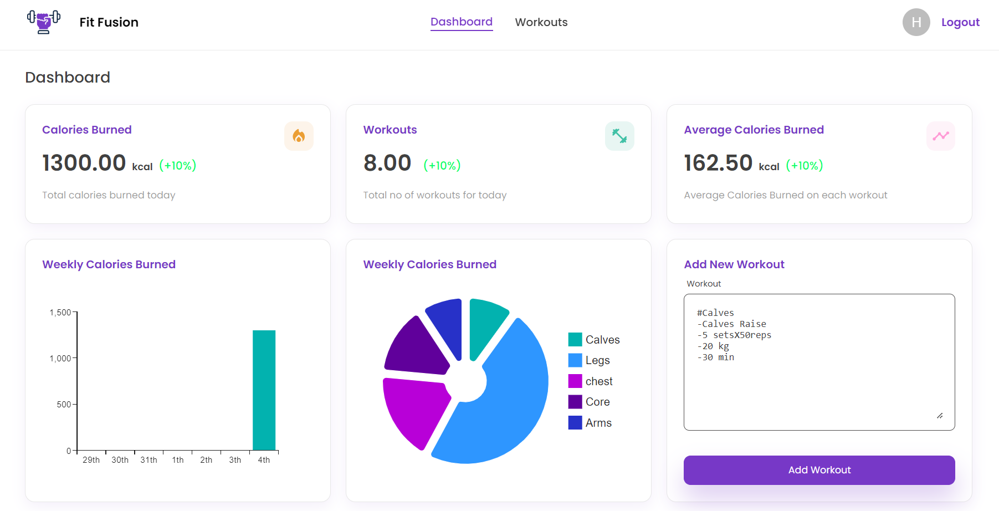
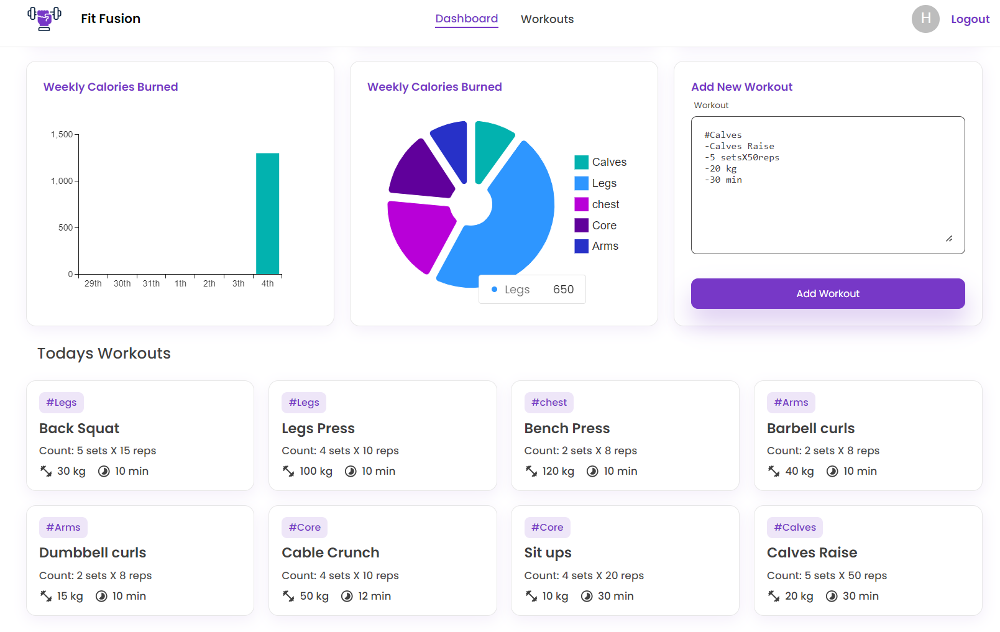
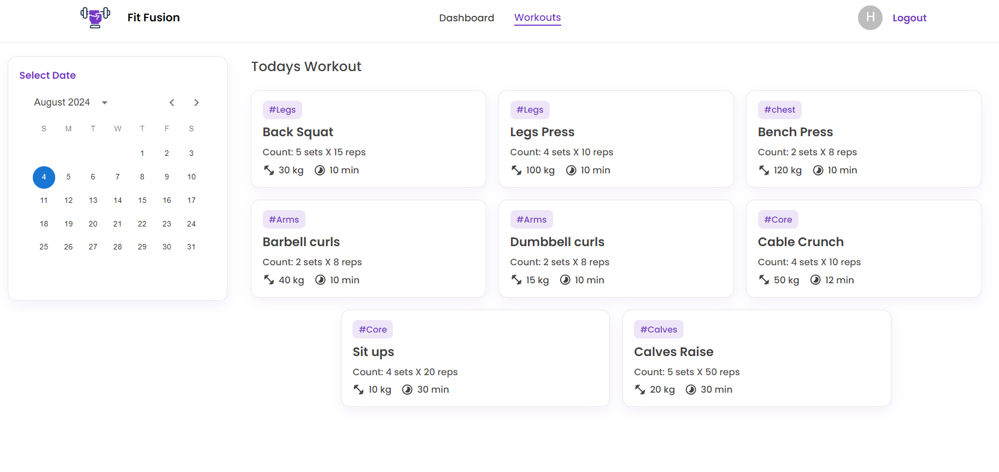
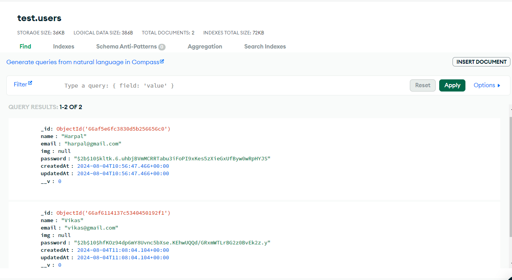
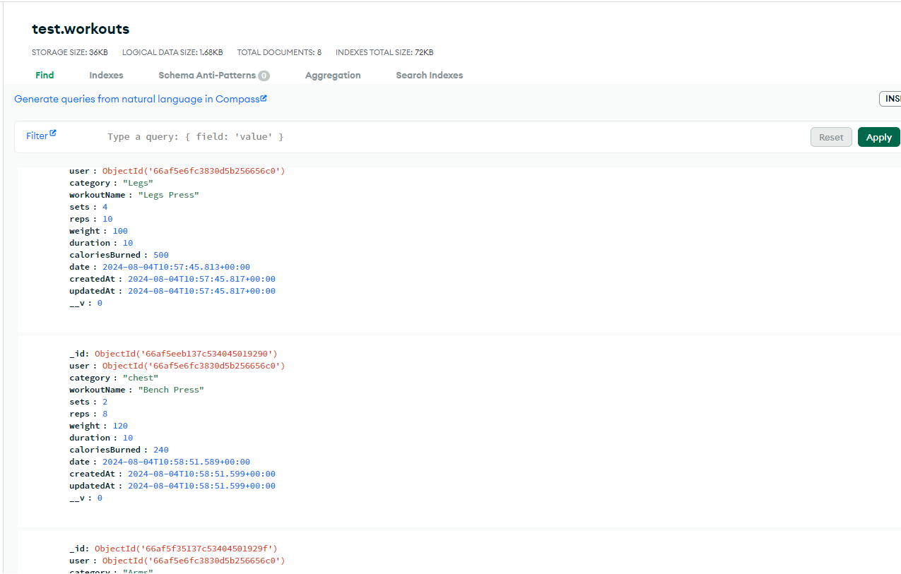

# Fit Fusion

## Intro
Fit Fusion is a comprehensive fitness tracking application built with the MERN stack. It provides users with the ability to manage their workouts, track calories burned, and analyze their fitness progress through intuitive charts and graphs.

## Some Screenshots
1.**Login Page**

2.**Register Page**

3.**Dashboard Page**

3.**Workouts Page**

3.**User Database**

3.**Workout Database**

## About

Fit Fusion is a comprehensive fitness tracking application with the following functionalities:

### User Authentication
- **User Login**: Allows users to log in securely with JWT authentication.
- **User Registration**: New users can register and create an account.

### Workout Management
- **Add Workout**: Users can add new workouts, which are stored in the database individually for each user.

### Calorie Tracking
- **Calories Burned**: The app calculates and displays the calories burned per workout.
- **Total Calories**: Users can track the total calories burned each week.

### Dashboard Analytics
- **Analytics View**: Provides detailed analytics with pie charts and bar charts to visualize calories burned.
- **Calendar View**: Users can see calories burned according to specific dates on a calendar.

## Tech Stack

**Frontend:**

- **ReactJS**: For building the user interface.
- **React Router**: For routing.
- **Styled Components**: For styling React components.
- **CSS & Material UI**: For additional styling and UI components.
- **Redux**: For state management.

**Backend:**

- **Express**: For building the server and handling routes.
- **Mongoose**: For interacting with MongoDB.
- **MongoDB**: As the database to store user data and workouts.
- **JWT (JSON Web Tokens)**: For secure user authentication.
- **bcrypt**: For password hashing.

## How It Works

- Users can register and log in with secure authentication using JWT.
- Passwords are hashed using bcrypt for added security.
- Once logged in, users can add new workouts.
- Each workout is stored individually in the database for each user.
- The app calculates and displays calories burned per workout.
- Users can track the total calories burned each week.
- The dashboard provides detailed analytics:
  - Pie charts and bar charts for visualizing calorie burn.
  - A calendar view to see calories burned according to specific dates.
